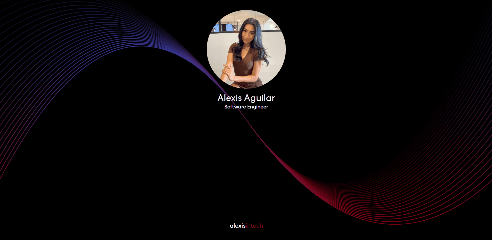

# 🪐 [Links](https://alexisintech.github.io/links/)

> This website provides quick and easy access to my social media links. I built this as an alternative to a link tree as link tree limits certain links and limits creative freedom.

### Old version

### New version

<!-- BUILT WITH -->

## 🛠️ Built With

- React (Vite)
- Tailwind
- HTML5, CSS3
- JavaScript
- ESLint

<!-- TEA SPILL -->

## 🌝 Tea Spill

I really love expressing my creative side, so building an unassigned project strictly for personal-use was actually a stress-free, fun time.
The first version of this application was built with raw HTML and CSS, and now that I'm further into my web development journey, I decided to give the website a revamp. As a React enthusiast, I knew React was going to be my choice for rebuilding the frontend. I spun up a quick React app using npm create vite@latest. For styling, I wanted a more sophisticated UI so I went with Tailwind, which led to a very fast and efficient styling experience. The documentation made set up simple and quick, and made figuring out the syntax for styling fluid and easy. I also went ahead and used Prettier for Tailwind as well, because why not! Once the styling was finished, Tailwind ended up helping reduce the CSS file by 255 lines of code. 
For optimization of the deployed website, I made sure to have my images converted to webp files and compressed using https://tiny-img.com/webp/
For accessibility, all of the images were sure to have alt tags. 
I used Lighthouse to give me a performance report, where I originally scored a 94 in accessibility for contrast issues with my footer text (Tailwind red-800 against a #000 background), and a 92 in SEO for the lack of a meta description.
I used Tailwind's documentation to find the hex codes of their text colors, and tested the red's against a #000 background by using WebAIM's contrast checker.
I added a meta tag with a description in the <head> of my HTML file.
My Lighthouse performance report then gave me 100's across the board, except for an 80 in performance due to my only image not being properly sized. But I had taken the steps to optimize and compress the image - that's as much as I'm going to get for now. 
